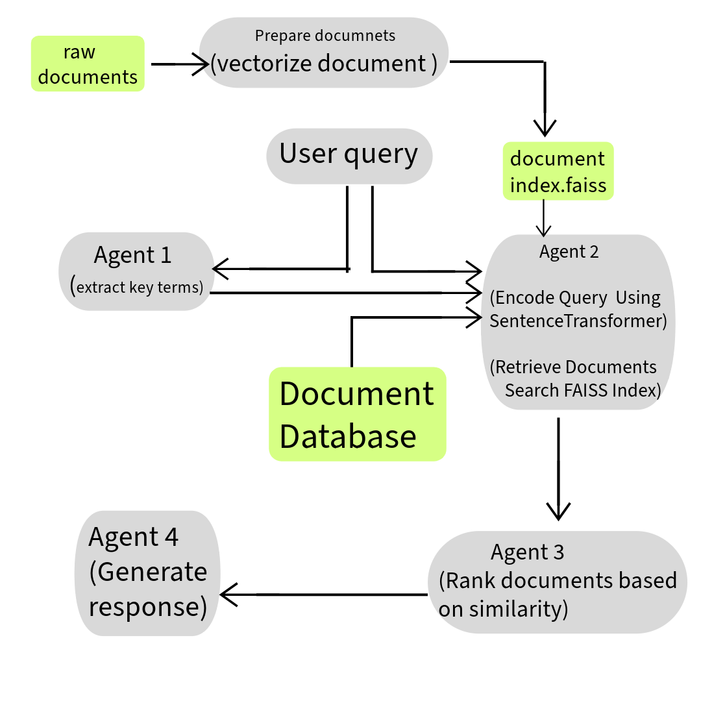

# Multi-Agent-Retrieval-Augmented-Generation-System

The System is designed to query and retrieve relevant information from a document set using multiple specialized Agents.
### Note: Due to resource constraints the "facebook/bart-large-cnn" was used for final output generation which affects the generation quality.
### Incase  GPU is available the model can be replaced (in generation.py) to any other hugging face model like"google/bigbird-pegasus-large-arxiv".For most appropriate results the Gpt-4 model can be used  through Openai API.

# System Flow showing interaction between multiple agents.




### System Overview

- **Agent 1: Query Parser**  
  - Analyzes user queries to extract key terms or topics.  
- **Agent 2: Document Retriever**  
  - Searches the document database for relevant files.  
- **Agent 3: Document Ranker**  
  - Ranks the retrieved documents by relevance.  
- **Agent 4: Response Generator**  
  - Synthesizes a concise answer from the top-ranked documents.

### Files Overview

- **app.py** 
  - The main file that serves as the entry point to run the system. It orchestrates the flow of the program by invoking the other modules in the correct sequence.
- **process.py** 
  -To preprocess .pdf files ,extract text , Preprocess  (tokenization and cleaning),Generate Embeddings using Sentence-Transformer, Store embeddings in document_index.faiss

- **keyword.py** (Agent 1)  
  - Implements the logic for analyzing and extracting key terms or topics from the user's query, which are then used to guide the document retrieval process.
- **retrieve.py**  (Agent 2)
  - Contains the functionality for searching and retrieving relevant documents from the database. It implements the logic for querying and filtering the document set based on the user's input.
- **rank.py**  (Agent 3)
  - Handles the ranking of the retrieved documents by relevance, ensuring the most pertinent documents are prioritized for response generation.
- **generate.py**   (Agent 4)
  - Responsible for generating responses by synthesizing information from the top-ranked documents retrieved by the `retrieve.py` module. It composes concise answers based on relevant content.


### Running the System

To run the system, execute the following command:


```bash
python -m pip install -r requirements.txt
python -m spacy download en_core_web_sm
streamlit run app.py


 

